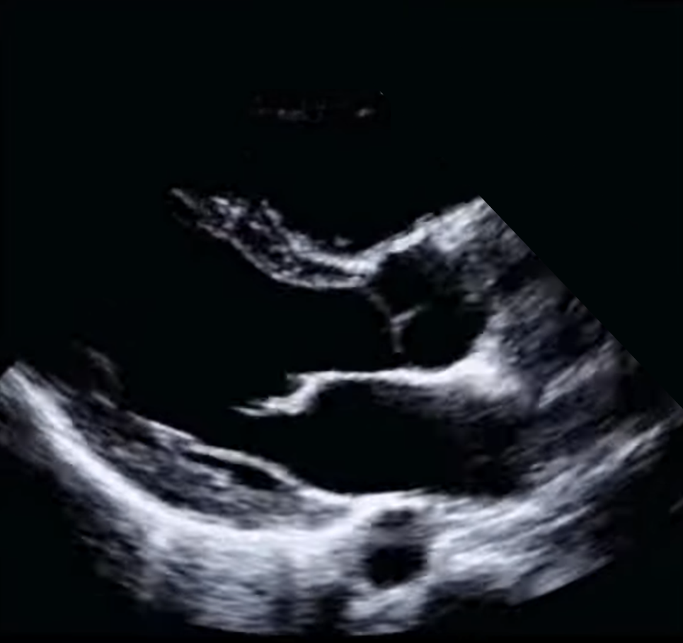

# PLAX EF Labels Dataset

This repository contains two datasets of EF (ejection fraction) labels for PLAX (parasternal long-axis) echocardiographic videos, derived from the [MIMIC-IV-ECHO](https://www.physionet.org/content/mimic-iv-echo/0.1/) and [MIMIC-IV-Note](https://physionet.org/content/mimic-iv-note/2.2/) dataset. These labels were generated through two distinct approaches and are intended for research use only. Each dataset includes labels formatted to align with the MIMIC-IV-ECHO dataset's structure, enabling seamless integration with corresponding echocardiographic files for those with appropriate access to MIMIC-IV.

---

## 🚀 Live Demos

- **[Hugging Face Demo](https://huggingface.co/spaces/Jeff4899/202509_PLAX_EF_Demo)** – Interactive web app for EF estimation from PLAX and A4C clips, with the option to upload your own videos.  
- **[Google Colab Notebook](https://colab.research.google.com/drive/1E2IWrfpBIKI4cBoBTCn3OLwEK9o3GTMM)** – Explore and run the inference code directly in Colab.  

---
## 📂 Description of Datasets

### 1. Generated Dataset – PLAX videos with EF labels  
**File**: `PLAX_with_EF_labels_proxy_dataset.csv`  
This dataset contains EF labels generated through the following pipeline:  
- **View Classification**: Applied a fine-tuned video view classifier to identify PLAX and A4C views in MIMIC-IV-ECHO.  
- **EF Value Generation**:  
  - Used a pre-trained A4C model to predict EF values for A4C videos.  
  - Averaged EF predictions across A4C videos in each study to assign EF labels to corresponding PLAX videos.  
- **Size**: 25,532 videos across 4,822 studies.  

---

### 2. Ground Truth Dataset – PLAX videos with EF labels  
**File**: `PLAX_with_EF_labels_ground_truth_dataset.csv`  
This dataset contains EF labels derived from clinical notes in the MIMIC-IV-NOTE dataset. Using time-based correlation and GPT-4 NLP, EF values were extracted from discharge summaries and paired with corresponding PLAX videos. After rigorous filtering and validation:  
- **Size**: 1,708 videos across 295 studies.  
- **Methodology**:  
  - Correlated echocardiography studies and clinical notes within a 1-day window.  
  - Extracted EF values from free-text notes using GPT-4.  
  - Validated EF values using a trained A4C model (trained using [EchoNet-Dynamic](https://echonet.github.io/dynamic/)), achieving a mean absolute error (MAE) of 6.64%.  

---

### 3. Ground Truth Dataset – A4C videos with EF labels  
**File**: `A4C_with_EF_labels_ground_truth_dataset.csv`  
This dataset contains EF labels derived from clinical notes in the MIMIC-IV-NOTE dataset. Using time-based correlation and GPT-4 NLP, EF values were extracted from discharge summaries and paired with corresponding A4C videos. After rigorous filtering and validation:  
- **Size**: 1,018 videos across 290 studies.  
- **Methodology**:  
  - Correlated echocardiography studies and clinical notes within a 1-day window.  
  - Extracted EF values from free-text notes using GPT-4.  
  - Validated EF values using a trained A4C model (trained using [EchoNet-Dynamic](https://echonet.github.io/dynamic/)), achieving a mean absolute error (MAE) of 6.95%.  

---

## 📑 File Format
Both datasets are provided as CSV files with the following columns:
- **subject_group**: Corresponds to the `pXX` group in MIMIC-IV-ECHO.
- **subject_id**: Corresponds to the `pXXXXXXX` ID in MIMIC-IV-ECHO.
- **study_id**: Corresponds to the `sXXXXXXX` ID in MIMIC-IV-ECHO.
- **file_id**: Corresponds to the `XXXX_XXXX` file identifier in MIMIC-IV-ECHO.
- **EF_value**: Ejection fraction value (percentage).

Example row:
```
p10,p10872900,s96990073,96990073_0057,66.43
```


Example PLAX Echocardiographic View:



*Note: This image is not sourced from the MIMIC dataset. It is an illustrative example obtained from an online source.*

---

## 🔧 Usage Instructions
To use these labels:
1. Ensure you have access to the MIMIC-IV-ECHO dataset.
2. Use the `subject_group`, `subject_id`, `study_id`, and `file_id` columns to locate the corresponding DICOM echo files in MIMIC-IV-ECHO.
3. The `EF_value` column provides the EF percentage for the corresponding video.

---

## 📦 Models and Code
- Example inference code is provided in the [Colab notebook](https://colab.research.google.com/drive/1E2IWrfpBIKI4cBoBTCn3OLwEK9o3GTMM).  
- Pretrained models are available on Hugging Face: [PLAX Models](https://huggingface.co/Jeff4899/202509_PLAX_EF) | [A4C Model](https://huggingface.co/Jeff4899/202509_A4C_EF).  
- If you want to replicate the full aggregation setup (2×PLAX + 1×A4C), we recommend downloading all model checkpoints from Hugging Face.  

We do **not** host large model files directly in this repository.  
Instead, use:
```python
from huggingface_hub import hf_hub_download

model_path = hf_hub_download(repo_id="your-hf-repo", filename="model.pt")
```

## License
This dataset is derived from the MIMIC-IV-ECHO and MIMIC-IV-NOTE datasets. Use of this dataset must comply with the MIMIC-IV Data Use Agreement. The labels are shared under the Creative Commons Attribution-NonCommercial 4.0 International (CC BY-NC 4.0) license. For full license details, see [CC BY-NC 4.0](https://creativecommons.org/licenses/by-nc/4.0/).

## Citation
If you use this dataset, please cite:
```
Gao et al., Learning from Scarce Labels: Multi-View Echocardiography for Ejection Fraction Prediction.
IEEE Transactions on Medical Imaging, under review
```

## References
This dataset is derived from the following publicly available datasets:
- MIMIC-IV-ECHO: Johnson AEW, Pollard TJ, Shen L, et al. (2020). MIMIC-IV Clinical Database. Version 2.0. Available at: https://www.physionet.org/content/mimic-iv-echo/0.1/
- MIMIC-IV-NOTE: Johnson AEW, Pollard TJ, Shen L, et al. (2020). MIMIC-IV Clinical Database. Version 2.0. Available at: https://physionet.org/content/mimic-iv-note/2.2/

Access to the original datasets requires completion of the PhysioNet Data Use Agreement.

